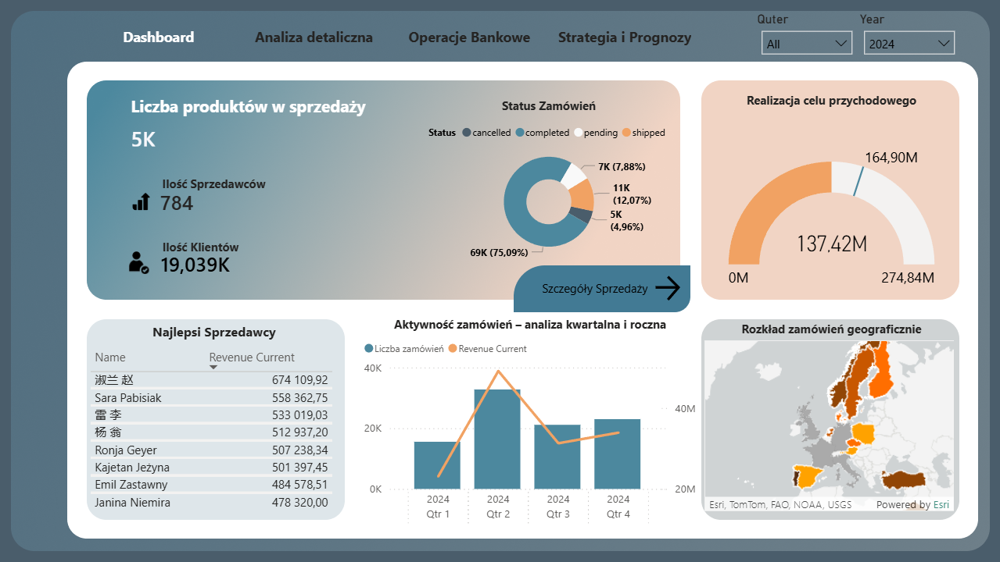
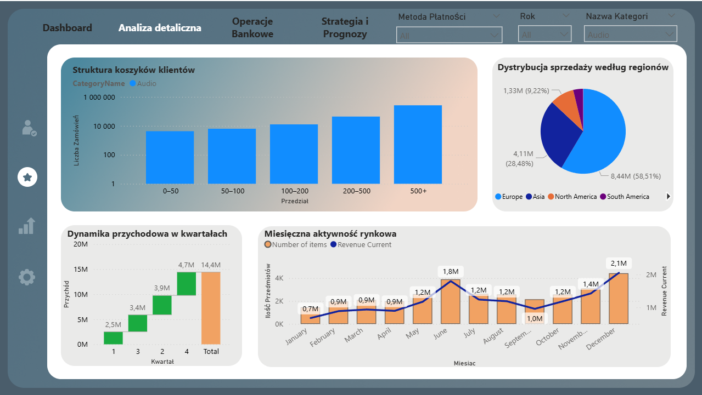
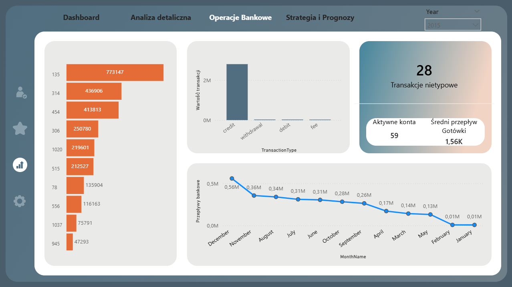
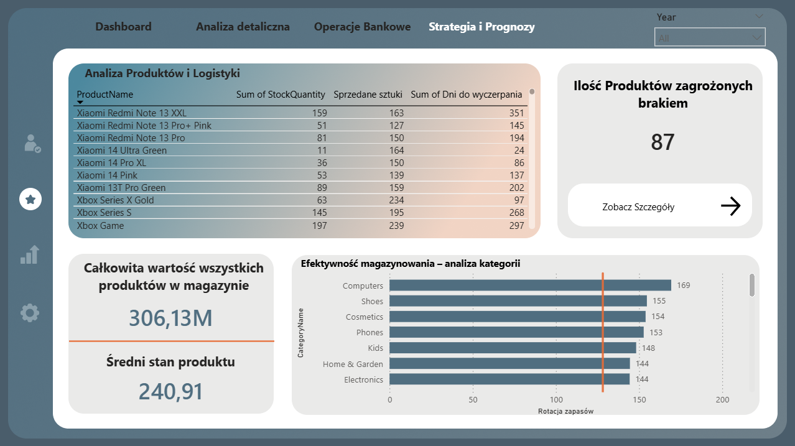
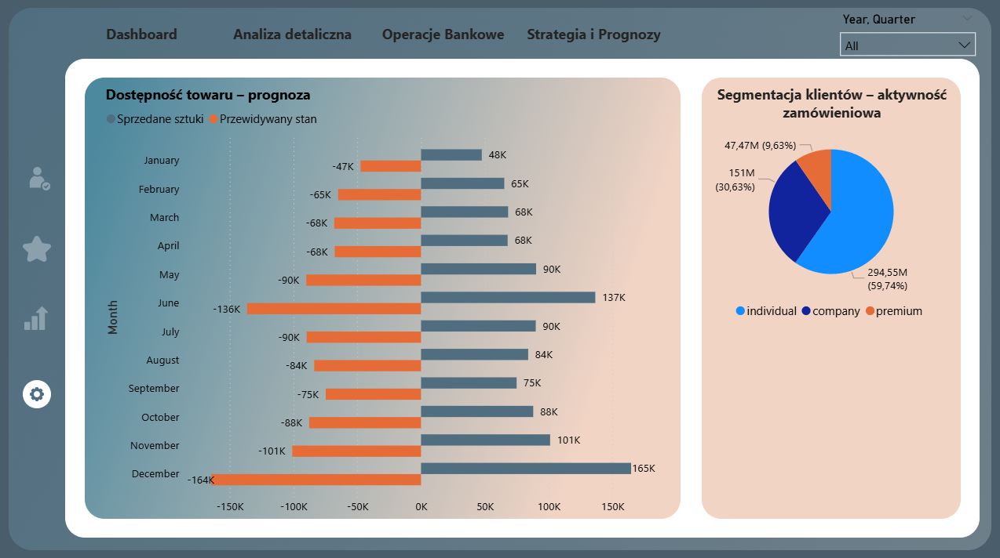
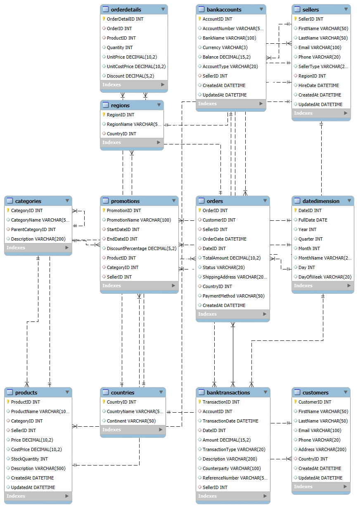

<div align="center">

# GlobalVista Analytics
### Zintegrowana Platforma Monitorowania i Analizy Sprzedaży oraz Danych Bankowych

[](https://azure.microsoft.com/)
[](https://python.org/)
[](https://www.microsoft.com/sql-server)
[](https://www.mongodb.com/)
[](https://powerbi.microsoft.com/)
[](https://flask.palletsprojects.com/)
[](LICENSE)

<br/>

<a href="docs/img/dashboard.png">
  
</a>

<p><em>Główny pulpit zarządczy (Executive Dashboard) – monitoring wskaźników KPI w czasie rzeczywistym</em></p>

</div>

---

> **Paczka demonstracyjna:** Projekt zawiera pełny kod źródłowy, dokumentację (ERD, BPMN) i raport Power BI, ale pozbawiony jest tekstu pracy dyplomowej i sekretów.
>
> **Uwaga dot. infrastruktury chmurowej:** Na potrzeby obrony pracy inżynierskiej system był w pełni wdrożony i zintegrowany z chmurą Azure (Azure SQL, Cosmos DB). Ze względu na koszty utrzymania chmury, usługi te zostały wygaszone. Poniższe kody pozwalają na uruchomienie systemu w środowisku lokalnym, a plik Power BI korzysta z zapisanego zrzutu danych.

---

## Problem Biznesowy i Rozwiązanie

<table>
<tr>
<td width="50%" valign="top">

### Wyzwanie Biznesowe
Nowoczesne przedsiębiorstwa łączące sprzedaż internetową z usługami finansowymi mierzą się ze zjawiskiem **silosów danych (Data Silos)**:
- **Rozproszenie informacji:** Dane o zamówieniach, klientach oraz rachunkach bankowych przechowywane są w odrębnych, niespójnych systemach.
- **Opóźnienia analityczne:** Raporty zarządcze tworzone manualnie docierają z opóźnieniem, co uniemożliwia szybką reakcję na spadki marżowości czy wahania płynności.
- **Brak predykcji:** Trudność w prognozowaniu zapotrzebowania i trendów sprzedażowych na kolejne kwartały w oparciu o dane historyczne.

</td>
<td width="50%" valign="top">

### Wdrożone Rozwiązanie
Platforma **GlobalVista Analytics** integruje cały łańcuch przetwarzania danych w spójne środowisko analityczne:
- **Centralna hurtownia hybrydowa:** Połączenie spójności transakcyjnej relacyjnej bazy SQL Server z elastycznością dokumentowej bazy MongoDB.
- **Automatyczne potoki ETL:** Skrypty w języku Python oczyszczają, walidują i transformują surowe dane do struktur analitycznych.
- **Wsparcie decyzji zarządczych:** Interaktywne dashboardy Power BI umożliwiają natychmiastowy wgląd w rentowność, płynność finansową i prognozy.

</td>
</tr>
</table>

---

## Raporty i Analizy Menedżerskie (Power BI)

Pulpity analityczne zostały podzielone na dedykowane obszary decyzyjne:

| Moduł Sprzedaży Detalicznej | Moduł Operacji Bankowych |
| :---: | :---: |
| <a href="docs/img/Analiza_detaliczna.png"></a> | <a href="docs/img/Operacje_Bankowe.png"></a> |
| **Pytanie biznesowe:** *Które rynki i kategorie produktów generują najwyższą marżę oraz jak kształtuje się średnia wartość koszyka?* | **Pytanie biznesowe:** *Jak wygląda płynność finansowa, wolumen transakcji oraz poziom aktywności na rachunkach klientów?* |

| Strategia i Prognozy | Szczegóły Strategiczne i Odchylenia |
| :---: | :---: |
| <a href="docs/img/strategia_i_prognozy.png"></a> | <a href="docs/img/strategia_i_prognozy-szczegoly.png"></a> |
| **Pytanie biznesowe:** *Jakie są prognozy przychodów na kolejne miesiące i w których segmentach zrealizujemy założone cele?* | **Pytanie biznesowe:** *Gdzie występują największe odchylenia od budżetu i jakie anomalie wymagają natychmiastowej interwencji?* |

---

## Model Relacyjny Danych (ERD)

Struktura bazy danych została zoptymalizowana pod kątem spójności transakcyjnej oraz wydajnego raportowania analitycznego:

<div align="center">
  <a href="docs/SalesDB_ERD.png">
    
  </a>
  <p><em>Relacyjny schemat bazy danych SalesDB – <a href="docs/database-schema.md">Pełna specyfikacja tabel i kolumn</a></em></p>
</div>

---

## Architektura i Stack Technologiczny

| Obszar | Technologie | Rola w systemie |
| :--- | :--- | :--- |
| **Bazy Danych** | MS SQL Server, MongoDB, Azure SQL, Cosmos DB | Przechowywanie danych strukturalnych oraz elastycznych kolekcji dokumentowych |
| **ETL i Przetwarzanie** | Python, Pandas, NumPy, pyodbc | Ekstrakcja, oczyszczanie, walidacja i standaryzacja rekordów |
| **Warstwa Aplikacyjna** | Flask, Flask-Login, Tailwind CSS | Panel webowy do zarządzania procesami i monitorowania danych |
| **Wizualizacja (BI)** | Power BI, DAX, Power Query | Modelowanie danych, kalkulacje miar biznesowych i interaktywne pulpity |

---

## Szybki Start (Uruchomienie Lokalne)

```bash
# 1. Klonowanie repozytorium i instalacja zależności
git clone https://github.com/DDawidek03/Sales-Analytics-Platform.git
cd Sales-Analytics-Platform
pip install -r requirements.txt

# 2. Konfiguracja zmiennych środowiskowych
cp .env.example .env

# 3. Utworzenie bazy SQL i wygenerowanie danych testowych
sqlcmd -S localhost -i src/database/SalesDB_SQLServer.sql
python src/tools/generate_sales_data.py --orders 1000
python src/tools/generate_nosql_data.py
python src/tools/load_data_to_db.py
python src/tools/load_json_to_mongodb.py

# 4. Uruchomienie aplikacji webowej
cd src/web && python app.py
# Panel dostępny pod adresem: http://127.0.0.1:5000
```

> Szczegółowy opis konfiguracji krok po kroku: [config/README_SETUP.md](config/README_SETUP.md).

---

## Dokumentacja Projektu

| Zasób | Opis | Link |
| :--- | :--- | :---: |
| **Schema Bazy Danych** | Definicje tabel, kolumn, indeksów i kluczy obcych | [Przejdź do dokumentu](docs/database-schema.md) |
| **Dokumentacja Bazy** | Założenia projektowe i optymalizacja zapytań | [Przejdź do dokumentu](docs/Dokumentacja-Bazy-Danych.md) |
| **System Uwierzytelniania** | Bezpieczeństwo sesji, haszowanie i uprawnienia RBAC | [Przejdź do dokumentu](docs/AUTH_SYSTEM.md) |
| **Wymagania Systemowe** | Zakres wymagań funkcjonalnych i pozafunkcjonalnych | [Przejdź do dokumentu](docs/WYMAGANIA_SYSTEMU.md) |
| **Procesy BPMN** | Modele przepływu procesów biznesowych i zasilania danymi | [Katalog BPMN](docs/bpmn/) |

---

## Licencja i Informacje o Autorze

Projekt udostępniony na warunkach licencji **MIT** ([LICENSE](LICENSE)).  
**Autor:** Damian Dawidek – *Praca Inżynierska 2026*
