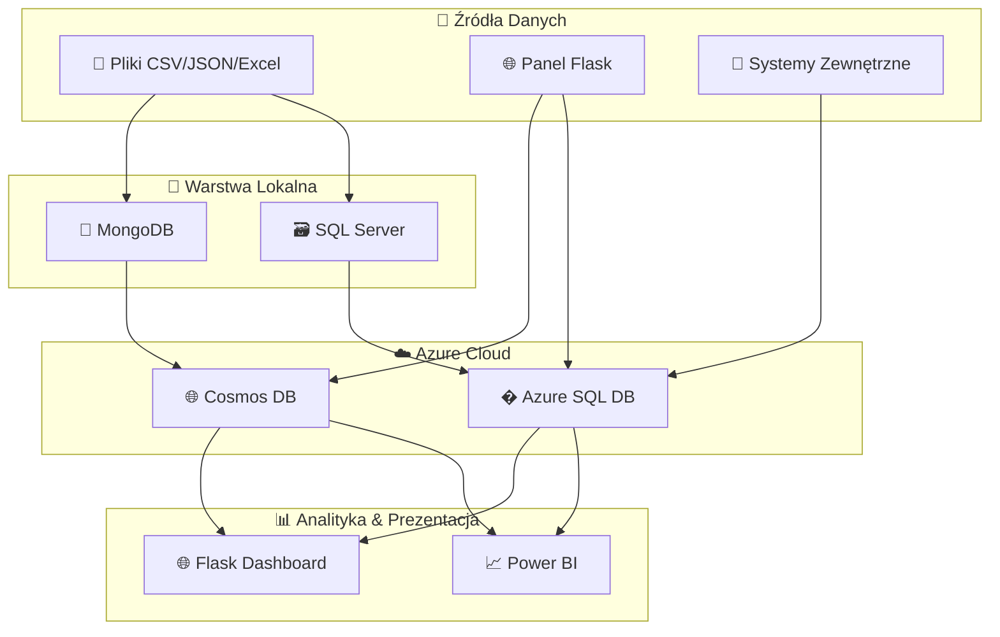

<div align="center">

# 🏦 GlobalVista Analytics
### System Monitorowania i Analizy Sprzedaży oraz Danych Bankowych

[](https://azure.microsoft.com/)
[](https://python.org/)
[](https://www.microsoft.com/sql-server)
[](https://www.mongodb.com/)
[](https://powerbi.microsoft.com/)
[](https://flask.palletsprojects.com/)
[](LICENSE)

*Kompletny system analityczny dla globalnej korporacji e-commerce i bankowości*

> **Paczka demonstracyjna:** Projekt zawiera pełny kod źródłowy, dokumentację (ERD, BPMN) i raport Power BI, ale pozbawiony jest tekstu pracy dyplomowej i sekretów.
> **Uwaga dot. infrastruktury chmurowej:** Na potrzeby obrony pracy inżynierskiej system był w pełni wdrożony i zintegrowany z chmurą Azure (Azure SQL, Cosmos DB). Ze względu na koszty utrzymania chmury, usługi te zostały wygaszone. Poniższe kody pozwalają na uruchomienie systemu w środowisku lokalnym, a plik Power BI korzysta z zapisanego zrzutu danych.

**📅 Status:** Ukończony - Styczeń 2026

</div>

---

## 🎯 Cel Projektu

> **Stworzenie kompletnego systemu analitycznego** umożliwiającego pobieranie, oczyszczanie, przechowywanie i wizualizację danych sprzedażowych oraz bankowych fikcyjnej globalnej korporacji w czasie rzeczywistym.

### 🌟 Kluczowe Funkcje

- 📊 **Analiza w Czasie Rzeczywistym** - Monitorowanie KPI i trendów sprzedażowych
- � **Hybrydowa Architektura Danych** - SQL Server + MongoDB + Azure Cloud
- 🧹 **Automatyczne Oczyszczanie Danych** - Python + Power Query
- 📈 **Interaktywne Dashboardy** - Power BI z możliwością drilldown
- 🌐 **Panel Administracyjny** - Flask webapp do zarządzania danymi
- 🔒 **System Bezpieczeństwa** - PBKDF2-HMAC-SHA256, RBAC, Flask-Login
- ☁️ **Skalowalność Chmurowa** - Pełna integracja z ekosystemem Azure

---

## 🏗️ Architektura Systemu

<div align="center">



</div>

---

## 🛠️ Stack Technologiczny

<table>
<tr>
<td valign="top" width="33%">

### 💾 **Bazy Danych**
- 🗃️ **MS SQL Server** - Dane strukturalne
- 🍃 **MongoDB** - Dane elastyczne  
- ☁️ **Azure SQL Database** - Cloud SQL
- 🌐 **Azure Cosmos DB** - NoSQL w chmurze

</td>
<td valign="top" width="33%">

### 🔧 **Backend & Processing**
- 🐍 **Python 3.x** - ETL i oczyszczanie danych
- 🌐 **Flask 2.x** - Panel administracyjny
- 🔒 **Flask-Login** - Sesje użytkowników
- � **Pandas/NumPy** - Przetwarzanie danych

</td>
<td valign="top" width="33%">

### 📊 **Analityka & Frontend**
- 📈 **Power BI** - Dashboardy biznesowe
- 💻 **HTML/CSS/JS** - Interface użytkownika
- 🎨 **Tailwind CSS** - Styling framework
- 📱 **Responsive Design** - Mobile-first

</td>
</tr>
</table>

---

## 📂 Struktura Projektu

```
📁 Praca_Inzynierska/
├── 📋 README.md
├── � LICENSE
├── 📁 docs/                          # 📖 Dokumentacja
│   ├── 📋 database-schema.md
│   ├── 📋 Dokumentacja-Bazy-Danych.md
│   ├── 📋 AUTH_SYSTEM.md             # 🔒 System uwierzytelniania
│   ├── 📋 WYMAGANIA_SYSTEMU.md       # 📝 Wymagania funkcjonalne
│   ├── 🖼️ SalesDB_ERD.png            # Diagram ERD
│   └── 📁 bpmn/                      # Diagramy procesów BPMN
├── 📁 src/                           # 💻 Kod źródłowy
│   ├── 📁 database/                  # 🗃️ Skrypty baz danych
│   │   ├── 📄 SalesDB_MySQL.sql
│   │   ├── 📄 SalesDB_SQLServer.sql
│   │   └── 📄 SalesCollections_MongoDB.js
│   ├── 📁 tools/                     # 🔧 Narzędzia ETL
│   │   ├── 🐍 data_validation.py         # Walidacja danych
│   │   ├── 🐍 generate_sales_data.py     # Generator danych SQL
│   │   ├── 🐍 generate_nosql_data.py     # Generator danych NoSQL
│   │   ├── 🐍 load_data_to_db.py         # Ładowanie do baz
│   │   └── 🐍 load_json_to_mongodb.py    # Import JSON do MongoDB
│   └── 📁 web/                       # 🌐 Aplikacja webowa
│       ├── 🐍 app.py                     # Główna aplikacja Flask
│       ├── 🐍 run.py                     # Skrypt startowy
│       ├── 🐍 auth_handler.py            # 🔒 Uwierzytelnianie
│       ├── 🐍 database_handler.py        # Obsługa baz danych
│       ├── 🌐 index.html                 # Strona główna
│       ├── 🌐 dashboard.html             # Panel analityczny
│       ├── 🌐 login.html                 # Strona logowania
│       ├── 🌐 admin.html                 # Panel administracyjny
│       ├── 📋 dashboard.js               # Logika dashboardu
│       ├── 🎨 styles.css
│       ├── 🎨 dashboard.css
│       ├── 🎨 login.css
│       ├── 🎨 admin.css
│       └── 🎨 tailwind.css
└── 📁 .venv/                         # 🐍 Środowisko wirtualne Python
```

---

## 🎯 Kluczowe Funkcjonalności

<div align="center">

| 🏢 **Moduł** | 📊 **Funkcje** | 🛠️ **Technologie** |
|---------------|-----------------|-------------------|
| **Sprzedażowy** | Produkty, Zamówienia, Klienci, Kategorie | SQL Server, Azure SQL |
| **Bankowy** | Konta, Transakcje, Płatności | SQL Server, Python |
| **Geograficzny** | Kraje, Regiony, Analiza lokalizacji | MongoDB, Cosmos DB |
| **Analityczny** | KPI, Trendy, Prognozy | Power BI, Python |

</div>


---

## 📖 Dokumentacja
<div align="center">


| 📄 **Dokument** | 📝 **Opis** | 🔗 **Link** |
|------------------|--------------|-------------|
| **Schema Bazy Danych** | Struktura tabel i relacji | [📋 docs/database-schema.md](docs/database-schema.md) |
| **Dokumentacja Bazy** | Szczegółowy opis implementacji | [📋 docs/Dokumentacja-Bazy-Danych.md](docs/Dokumentacja-Bazy-Danych.md) |
| **System Uwierzytelniania** | Bezpieczeństwo i autoryzacja | [📋 docs/AUTH_SYSTEM.md](docs/AUTH_SYSTEM.md) |
| **Wymagania Systemu** | Funkcjonalne i niefunkcjonalne | [📋 docs/WYMAGANIA_SYSTEMU.md](docs/WYMAGANIA_SYSTEMU.md) |
| **Diagramy BPMN** | Procesy biznesowe | [📁 docs/bpmn/](docs/bpmn/) |
| **Konfiguracja** | Uruchomienie i zmienne środowiskowe | [📋 config/README_SETUP.md](config/README_SETUP.md) |
| **Bezpieczeństwo** | Zasady publikacji i uruchamiania | [🔒 SECURITY.md](SECURITY.md) |

</div>


## 📄 Licencja

Ten projekt jest licencjonowany na warunkach licencji MIT - zobacz plik [LICENSE](LICENSE) po szczegóły.

---

<div align="center">

### 👨‍💻 Autor

**Damian Dawidek**  
*Student Informatyki - Praca Inżynierska 2026*

</div>
