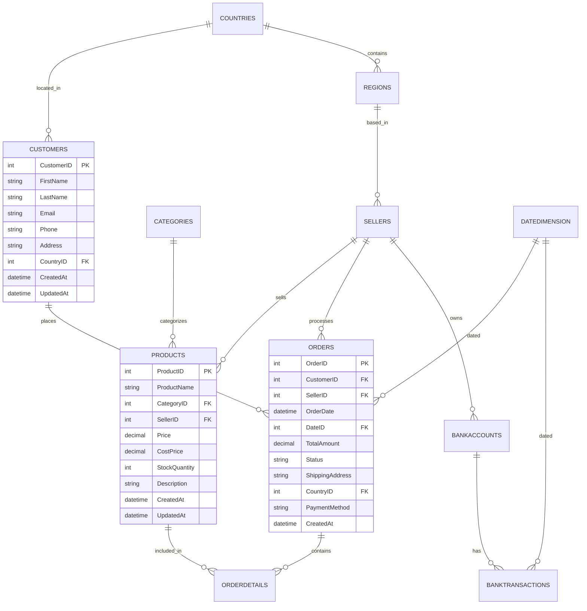

<div align="center">

# 🗄️ SalesDB - Schema Bazy Danych
### System Analityczny GlobalVista

[](https://www.microsoft.com/sql-server)
[](https://www.mongodb.com/)
[](https://azure.microsoft.com/)

**Status:** Wdrożony - Styczeń 2026

</div>

---

## 🎯 Przegląd Systemu

Baza danych **SalesDB** stanowi fundament kompleksowego systemu analitycznego dla globalnej korporacji e-commerce i bankowości. System wykorzystuje hybrydową architekturę łączącą SQL Server (dane strukturalne) z MongoDB (dane elastyczne).

### 🏆 Kluczowe Zalety

- 📊 **Wydajność** - Optymalizacja pod kątem analityki biznesowej
- 🔄 **Skalowalność** - Łatwa integracja z Azure Cloud
- 🔍 **Elastyczność** - Wsparcie dla różnych typów danych
- 🛡️ **Bezpieczeństwo** - Kontrola dostępu i audyt

---

## 🗃️ Architektura SQL Server

### 🛒 Moduł E-commerce

<table>
<tr>
<td valign="top" width="50%">

#### 👥 **Customers**
```sql
CustomerID (PK)      INT
FirstName            VARCHAR(50)
LastName             VARCHAR(50)
Email                VARCHAR(100) UNIQUE
Phone                VARCHAR(20)
Address              VARCHAR(200)
CountryID (FK)       INT
CreatedAt            DATETIME
UpdatedAt            DATETIME
```

#### 📦 **Products**
```sql
ProductID (PK)       INT
ProductName          VARCHAR(100)
CategoryID (FK)      INT
SellerID (FK)        INT
Price                DECIMAL(10,2)
CostPrice            DECIMAL(10,2)
StockQuantity        INT
Description          VARCHAR(500)
CreatedAt            DATETIME
UpdatedAt            DATETIME
```

</td>
<td valign="top" width="50%">

#### 🛍️ **Orders**
```sql
OrderID (PK)         INT
CustomerID (FK)      INT
SellerID (FK)        INT
OrderDate            DATETIME
DateID (FK)          INT
TotalAmount          DECIMAL(10,2)
Status               VARCHAR(20)
ShippingAddress      VARCHAR(200)
CountryID (FK)       INT
PaymentMethod        VARCHAR(50)
CreatedAt            DATETIME
```

#### 📋 **OrderDetails**
```sql
OrderDetailID (PK)   INT
OrderID (FK)         INT
ProductID (FK)       INT
Quantity             INT
UnitPrice            DECIMAL(10,2)
UnitCostPrice        DECIMAL(10,2)
Discount             DECIMAL(5,2)
```

</td>
</tr>
</table>

### 💰 Moduł Bankowy

<table>
<tr>
<td valign="top" width="50%">

#### 🏦 **BankAccounts**
```sql
AccountID (PK)       INT
AccountNumber        VARCHAR(50) UNIQUE
BankName             VARCHAR(100)
Currency             VARCHAR(3)
Balance              DECIMAL(15,2)
AccountType          VARCHAR(20)
SellerID (FK)        INT
CreatedAt            DATETIME
UpdatedAt            DATETIME
```

</td>
<td valign="top" width="50%">

#### 💳 **BankTransactions**
```sql
TransactionID (PK)   INT
AccountID (FK)       INT
TransactionDate      DATETIME
DateID (FK)          INT
Amount               DECIMAL(15,2)
TransactionType      VARCHAR(20)
Description          VARCHAR(200)
Counterparty         VARCHAR(100)
ReferenceNumber      VARCHAR(50)
SellerID (FK)        INT
```

</td>
</tr>
</table>

### 🌍 Moduły Wspólne

<table>
<tr>
<td valign="top" width="33%">

#### 🌎 **Countries**
```sql
CountryID (PK)       INT
CountryName          VARCHAR(50)
Continent            VARCHAR(50)
```

#### 🏘️ **Regions**
```sql
RegionID (PK)        INT
RegionName           VARCHAR(50)
CountryID (FK)       INT
```

</td>
<td valign="top" width="33%">

#### 👨‍💼 **Sellers**
```sql
SellerID (PK)        INT
FirstName            VARCHAR(50)
LastName             VARCHAR(50)
Email                VARCHAR(100) UNIQUE
Phone                VARCHAR(20)
SellerType           VARCHAR(20)
RegionID (FK)        INT
HireDate             DATETIME
CreatedAt            DATETIME
UpdatedAt            DATETIME
```

</td>
<td valign="top" width="33%">

#### 📅 **DateDimension**
```sql
DateID (PK)          INT
FullDate             DATE
Year                 INT
Quarter              INT
Month                INT
MonthName            VARCHAR(20)
Day                  INT
DayOfWeek            VARCHAR(20)
```

</td>
</tr>
</table>

---

## 🍃 Kolekcje MongoDB

### 📊 Schema Dokumentów

<table>
<tr>
<td valign="top" width="50%">

#### 🛒 **PurchaseHistories**
```javascript
{
  CustomerID: NumberInt,
  Email: String,
  CountryID: NumberInt,
  Purchases: [{
    OrderID: NumberInt,
    OrderDate: Date,
    Year: NumberInt,
    Quarter: NumberInt,
    Month: NumberInt,
    TotalAmount: NumberDouble,
    Status: String,
    Seller: {
      SellerID: NumberInt,
      SellerName: String,
      SellerType: String,
      RegionID: NumberInt
    },
    Products: [{
      ProductID: NumberInt,
      ProductName: String,
      CategoryID: NumberInt,
      CategoryName: String,
      Quantity: NumberInt,
      UnitPrice: NumberDouble,
      UnitCostPrice: NumberDouble,
      Discount: NumberDouble
    }],
    ShippingCountryID: NumberInt,
    PaymentMethod: String
  }],
  LastUpdated: Date
}
```

</td>
<td valign="top" width="50%">

#### 🏦 **BankTransactionLogs**
```javascript
{
  AccountID: NumberInt,
  AccountNumber: String,
  Currency: String,
  Transactions: [{
    TransactionID: NumberInt,
    TransactionDate: Date,
    Year: NumberInt,
    Quarter: NumberInt,
    Month: NumberInt,
    Amount: NumberDouble,
    TransactionType: String,
    Description: String,
    Counterparty: String,
    ReferenceNumber: String,
    Status: String,
    Seller: {
      SellerID: NumberInt,
      SellerName: String,
      SellerType: String,
      RegionID: NumberInt
    }
  }],
  LastUpdated: Date
}
```

</td>
</tr>
</table>

---

## 🔄 Diagram ERD

<div align="center">



</div>

---

## 📈 Optymalizacja i Indeksy

### 🚀 Strategia Indeksowania

```sql
-- Indeksy dla wydajności zapytań analitycznych
CREATE INDEX IX_Orders_CustomerID_DateID ON Orders(CustomerID, DateID);
CREATE INDEX IX_OrderDetails_ProductID ON OrderDetails(ProductID);
CREATE INDEX IX_Products_CategoryID_SellerID ON Products(CategoryID, SellerID);
CREATE INDEX IX_BankTransactions_AccountID_DateID ON BankTransactions(AccountID, DateID);

-- Indeksy dla raportowania
CREATE INDEX IX_Orders_Status_OrderDate ON Orders(Status, OrderDate);
CREATE INDEX IX_BankTransactions_Type_Amount ON BankTransactions(TransactionType, Amount);
```

### 📊 Przykładowe Zapytania Analityczne

```sql
-- Top 10 produktów według sprzedaży
WITH ProductSales AS (
    SELECT 
        p.ProductName,
        c.CategoryName,
        SUM(od.Quantity * od.UnitPrice) as TotalRevenue,
        SUM(od.Quantity) as TotalQuantity
    FROM OrderDetails od
    JOIN Products p ON od.ProductID = p.ProductID
    JOIN Categories c ON p.CategoryID = c.CategoryID
    JOIN Orders o ON od.OrderID = o.OrderID
    WHERE o.Status = 'completed'
    GROUP BY p.ProductName, c.CategoryName
)
SELECT TOP 10 *
FROM ProductSales
ORDER BY TotalRevenue DESC;

-- Analiza sprzedaży według regionów
SELECT 
    r.RegionName,
    co.CountryName,
    COUNT(DISTINCT o.OrderID) as TotalOrders,
    SUM(o.TotalAmount) as TotalRevenue,
    AVG(o.TotalAmount) as AvgOrderValue
FROM Orders o
JOIN Sellers s ON o.SellerID = s.SellerID
JOIN Regions r ON s.RegionID = r.RegionID
JOIN Countries co ON r.CountryID = co.CountryID
WHERE o.OrderDate >= DATEADD(month, -12, GETDATE())
GROUP BY r.RegionName, co.CountryName
ORDER BY TotalRevenue DESC;
```

---

## 🛡️ Bezpieczeństwo i Zgodność

### 🔐 Kontrola Dostępu

- **Role-Based Access Control (RBAC)**
- **Szyfrowanie danych w spoczynku**
- **SSL/TLS dla transmisji danych**
- **Audyt wszystkich operacji**

### 📋 Compliance

- **GDPR** - Ochrona danych osobowych
- **PCI DSS** - Bezpieczeństwo danych płatniczych
- **SOX** - Kontrola finansowa

---

## 🔧 Konserwacja i Monitoring

### 📊 Metryki Wydajności

| **Metryka** | **Cel** | **Alert** |
|-------------|---------|-----------|
| Query Response Time | < 500ms | > 1s |
| Database Size Growth | < 10% miesięcznie | > 15% |
| Index Fragmentation | < 30% | > 40% |
| Connection Pool Usage | < 80% | > 90% |

### 🔄 Backup Strategy

- **Full Backup** - Cotygodniowo
- **Differential Backup** - Codziennie
- **Transaction Log Backup** - Co 15 minut
- **Point-in-time Recovery** - 7 dni

---

<div align="center">

### 📚 Dodatkowe Zasoby

[🔗 API Reference](api-reference.md) • 
[🚀 Deployment Guide](deployment-guide.md) • 
[🧪 Testing Strategy](testing-guide.md)

---

**Dokumentacja wygenerowana dla GlobalVista Analytics v1.0**  
*Ostatnia aktualizacja: Styczeń 2025*

</div>
